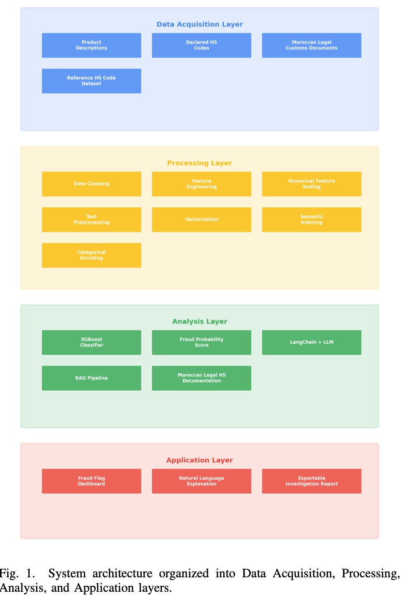

# customs-fraud-detection-rag
AI-Driven Detection of Misclassified Imports using XGBoost, LangChain, and Retrieval-Augmented Generation (RAG)


# AI-Driven Detection of Misclassified Imports

## Overview

This project presents a hybrid AI system for customs fraud detection through product misclassification analysis.

The solution combines:

- XGBoost
- LangChain
- Retrieval-Augmented Generation (RAG)
- FAISS Vector Search
- Explainable AI

## Architecture



## Results

| Metric | Score |
|----------|----------|
| Fraud Detection F1 | 0.811 |
| Precision | 0.972 |
| Recall | 0.697 |
| Real Data F1 | 0.765 |
| HS Code Accuracy | 90.2% |

## Repository Structure

```text
paper/
notebooks/
images/
src/
data/
results/
```

## Paper

The full research paper is available in:

paper/AI_Driven_Detection_of_Misclassified_Imports.pdf
